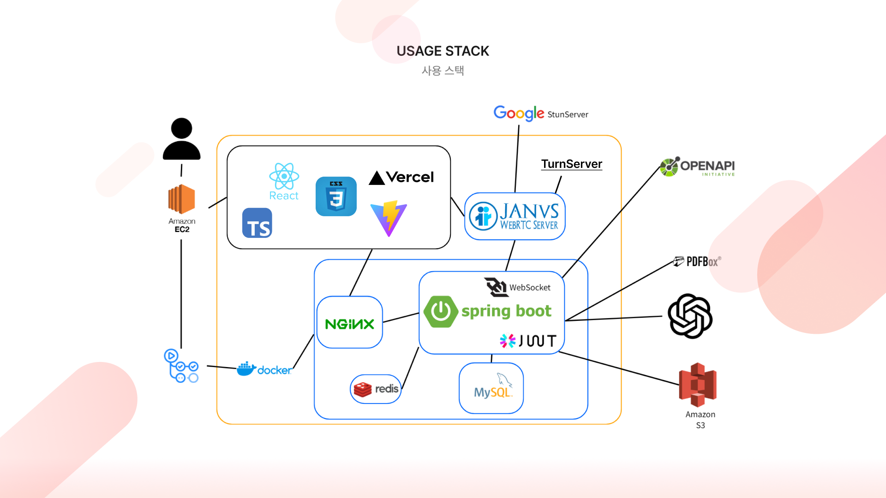

<a href="https://www.actionary.site/" target="_blank">

</a>

<br/>
<br/>

# 0. Getting Started (시작하기)
```bash
$ npm start
```
[서비스 링크](https://www.actionary.site/)

<br/>
<br/>

# 1. Project Overview (프로젝트 개요)
- 프로젝트 이름: Actionary
- 프로젝트 설명: 모든 갓생 습관을 한곳에 담은 올인원 생산성 플랫폼

<br/>
<br/>

# 2. Team Members (팀원 및 팀 소개)
| 김가인 | 배송이 | 이나경 |
|:------:|:------:|:------:|
|  |  |  |
| FE Leader | FE | FE |
| [GitHub](https://github.com/gain-0525) | [GitHub](https://github.com/peisonger) | [GitHub](https://github.com/LINAGG1) | 

<br/>
<br/>

# 3. Key Features (주요 기능)
- **회원가입**:
  - 회원가입 시 DB에 유저정보가 등록됩니다.

- **로그인**:
  - 사용자 인증 정보를 통해 로그인합니다.

- **스터디**:
  - 사용자가 스터디를 생성하고 참여할 수 있는 실시간 화상 스터디 기능입니다.
  - 스터디 내에서 카메라와 마이크 기능을 제공하며 스터디 내 채팅을 제공합니다.
  - 스터디 내에서 뽀모도로 기능을 실행할 수 있으며 공부 시간과 쉬는 시간을 관리할 수 있습니다.

- **투두 리스트**:
  - 오늘 할 일들에 대한 카테고리와 투두리스트 생성을 제공합니다.
  - 캘린더에서 투두리스트 달성 개수와 달성률을 아이콘으로 한눈에 확인할 수 있습니다.

- **게시판**:
  - 말머리를 선택하여 자유롭게 게시글을 생성, 수정, 삭제할 수 있습니다.
  - 일반 댓글과 비밀 댓글 기능을 제공하여 사용자들과 소통할 수 있습니다.

- **Ai 요약 서비스**:
  - 파일을 제공하면 AI가 핵심 내용을 요약합니다.

- **사이드바**:
  - 사이드바로 오늘의 투두리스트, 공부시간과 누적 포인트를 간편하게 조회할 수 있습니다.
  - 사이드바 내 알림창을 통하여 본인에게 온 알림들을 확인할 수 있습니다.

- **마이페이지**:
  - 본인의 개인 정보 수정이 가능합니다.
  - 누적 포인트와 포인트에 따른 배지 조회가 가능합니다
  - 자주 사용하는 사이트는 북마크 등록을 통해 바로 이동 가능합니다. 

<br/>
<br/>

# 4. Tasks & Responsibilities (작업 및 역할 분담)
|  |  |  |
|-----------------|-----------------|-----------------|
| 김가인    |   | <ul><li>홈페이지 개발</li><li>사이드바 및 알림창 개발</li><li>게시판 페이지 개발</li><li>마이 페이지 개발</li><li>Ai 요약 서비스 개발</li></ul>     |
| 배송이   |  | <ul><li>스터디 페이지 개발</li><li>스터디 접속 페이지 개발</li></ul> |
| 이나경   |      |<ul><li>투두리스트 페이지 개발</li><li>로그인 및 회원가입 페이지 개발</li><li>헤더 개발</li></ul>  |

<br/>
<br/>

# 5. Technology Stack (기술 스택)


<br/>

# 6. Project Structure (프로젝트 구조)
```plaintext
req2res/
├── public/
│   ├── janus.js           # 실시간 화상·음성·데이터 통신 라이브러리
│   └── main.tsx           # 쿼리 전역 관리 설정
├── src/
│   ├── assets/              # 이미지, 폰트 등 정적 파일
│   ├── components/          # 재사용 가능한 UI 컴포넌트
│   ├── hooks/               # 커스텀 훅 모음
│   ├── pages/               # 각 페이지별 컴포넌트
│   ├── api/               # api 호출 코드
│   ├── types/             # 타입 정의
│   ├── utils/            # 공통 사용 유틸리티 함수
│   ├── App.tsx    # 라우팅 파일
│   package-lock.json    # 정확한 종속성 버전이 기록된 파일로, 일관된 빌드를 보장
│   package.json         # 프로젝트 종속성 및 스크립트 정의
├── .gitignore               # Git 무시 파일 목록
└── README.md                # 프로젝트 개요 및 사용법
```

<br/>
<br/>

# 7. Development Workflow (개발 워크플로우)
## 브랜치 전략 (Branch Strategy)
우리의 브랜치 전략은 Git Flow를 기반으로 하며, 다음과 같은 브랜치를 사용합니다.

- Main Branch
  - 배포 가능한 상태의 코드를 유지합니다.
  - 모든 배포는 이 브랜치에서 이루어집니다.
  
- {feature} Branch
  - 팀원 각자의 개발 브랜치입니다.
  - 모든 기능 개발은 이 브랜치에서 이루어집니다.

<br/>
<br/>

# 8. Coding Convention


## 명명 규칙
* 변수 & 함수 : 카멜케이스
```
// state
const [isLoading, setIsLoading] = useState(false);
const [isLoggedIn, setIsLoggedIn] = useState(false);
const [errorMessage, setErrorMessage] = useState('');
const [currentUser, setCurrentUser] = useState(null);


// 이벤트 핸들러: 'on'으로 시작
const onClick = () => {};
const onChange = () => {};

// 반환 값이 불린인 경우: 'is'로 시작
const isLoading = false;
```

<br/>

## 폴더 네이밍
폴더 명은 파스칼 케이스로 작성하였으며 hook은 카멜 케이스로 작성하였습니다.
```
// 카멜 케이스
camelCase
// 파스칼 케이스
PascalCase
```

<br/>

## 파일 네이밍
```
css 파일을 제외한 모든 파일들은 .tsx 형식
customHook을 사용하는 경우 : use + 함수명
```

<br/>
<br/>

# 9. 커밋 컨벤션
## 기본 구조
```
type : subject

body 
```

<br/>

## type 종류
```
feat : 새로운 기능 추가
fix : 버그 수정
docs : 문서 수정
style : 코드 포맷팅, 세미콜론 누락, 코드 변경이 없는 경우
refactor : 코드 리펙토링
test : 테스트 코드, 리펙토링 테스트 코드 추가
chore : 빌드 업무 수정, 패키지 매니저 수정
```

<br/>


## 커밋 예시
```
== ex1
[Feat]: "회원 가입 기능 구현"

SMS, 이메일 중복확인 API 개발

== ex2
[Fix]: "북마크 UI 수정"

북마크 이름과 링크 길이를 수정
```

<br/>
<br/>


